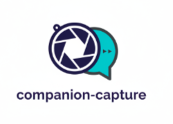

<div align="center">
  
  <h1>companion-capture</h1>
  <p>Capture AI companion speech bubble messages from Claude Code terminal sessions.</p>
</div>

When Claude Code runs, a small companion character appears beside the input box and occasionally comments in a speech bubble. These messages are ephemeral — they vanish as the TUI redraws. **companion-capture** watches the terminal output, extracts those bubbles, and saves them to markdown files you can read later.

<!-- TODO: Replace with actual demo GIF -->
<!--  -->

## How It Works

```
wrapper.sh  →  script -q -F (captures TUI)  →  session.log
                                                     ↓
                                              parser.py (tail -f, non-blocking)
                                                     ↓
                                              ScreenBuffer (VT100 cursor tracking)
                                                     ↓
                                           ┌─────────┴─────────┐
                                     [vibe] entries      [debug] entries
                                           ↓                    ↓
                                    <name>-captures.md   <name>-debug.md
                                     (persistent)        (per-session)
                                           ↓                    ↓
                                    check.sh (PostToolUse hook, SIGUSR1 flush)
                                           ↓
                                    Claude sees new entries mid-session
```

The parser uses a **VT100 screen buffer** (not ANSI stripping) to track cursor positions, so text lands at the correct coordinates even when the TUI repositions content. Messages require two consecutive scans before being written, preventing partial renders from being captured.

## Requirements

- macOS (Linux support planned for a future release)
- Python 3.9+
- [Claude Code](https://docs.anthropic.com/en/docs/claude-code) CLI

## Installation

### Quick Install

```bash
git clone https://github.com/jaywadhwa/companion-capture.git
cd companion-capture
pip install -e ".[dev]"
./scripts/install.sh
```

The installer will:

1. Create `~/.companion-capture/config.json` with defaults
2. Symlink scripts into `~/.companion-capture/bin/` (stable paths that survive repo moves)
3. Add a `claude` shell alias pointing to the symlinked wrapper
4. Configure the PostToolUse hook in Claude Code's `settings.json`

If you move the repo later, re-run `pip install -e ".[dev]"` and `./scripts/install.sh` to update the Python path and symlinks. The alias and hook don't change.

### Verify

```bash
companion-capture doctor
```

This checks: config validity, Python version, shell alias, PostToolUse hook, parser syntax, directory permissions, and parser heartbeat.

## Usage

Once installed, just use `claude` as normal — the wrapper handles everything:

```bash
claude  # launches Claude Code through the capture wrapper
```

Captured messages appear in `~/.claude/` (or your configured output directory):

| File                    | Contents                                |
| ----------------------- | --------------------------------------- |
| `Companion-captures.md` | Companion observations and reactions    |
| `Companion-debug.md`    | Debug/diagnostic messages (per-session) |
| `Companion-archive.md`  | Captures older than 7 days              |

### Commands

```bash
companion-capture doctor   # health check
companion-capture migrate  # migrate from a previous Keel installation
companion-capture --version
```

## Configuration

Config lives at `~/.companion-capture/config.json`. All fields are optional — defaults are used for anything not specified.

```json
{
  "companion_name": "Companion",
  "output_dir": "~/.claude/",
  "log_dir": "~/.companion-capture/logs/",
  "rotation_days": 7,
  "archive_days": 90,
  "debug": false
}
```

### Precedence

Defaults < config file < environment variables

| Config Field     | Env Var                   | Default                      |
| ---------------- | ------------------------- | ---------------------------- |
| `companion_name` | `COMPANION_NAME`          | `Companion`                  |
| `output_dir`     | `COMPANION_OUTPUT_DIR`    | `~/.claude/`                 |
| `log_dir`        | `COMPANION_LOG_DIR`       | `~/.companion-capture/logs/` |
| `rotation_days`  | `COMPANION_ROTATION_DAYS` | `7`                          |
| `archive_days`   | `COMPANION_ARCHIVE_DAYS`  | `90`                         |
| `debug`          | `COMPANION_DEBUG`         | `false`                      |

## Migrating from Keel

If you previously used the Keel implementation:

```bash
companion-capture migrate
```

This renames `KEEL-*.md` files, migrates marker files, removes the old shell alias and hook, and checks that companion-capture wiring is in place. Safe to run multiple times.

## Project Structure

```
companion-capture/
├── src/companion_capture/
│   ├── __init__.py        # version
│   ├── parser.py          # VT100 screen buffer + bubble extraction
│   ├── config.py          # JSON config model
│   ├── store.py           # SQLite event store (v2)
│   └── cli.py             # doctor, migrate commands
├── scripts/
│   ├── wrapper.sh         # session wrapper (script -q -F)
│   ├── check.sh           # PostToolUse hook
│   ├── archive.sh         # capture rotation
│   ├── install.sh         # idempotent installer
│   └── uninstall.sh       # clean removal
├── tests/                 # 218 pytest cases
├── pyproject.toml
└── .github/workflows/ci.yml
```

## License

[MIT](LICENSE)
